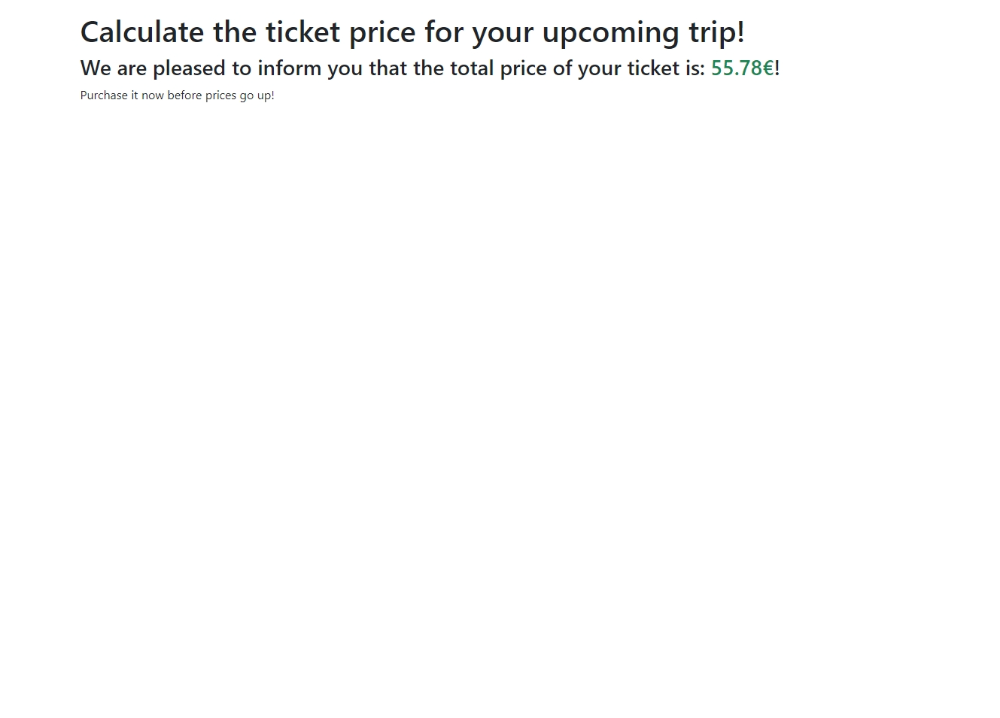

# Assignment
The program will need to ask the user for the number of kilometers they want to travel and the passenger's age. 
Based on this information, it will have to calculate the total price of the trip according to the following rules:

1. The ticket price is defined based on the kilometers (€0.21 per km);
2. A 20% discount is applied for minors; 
3. A 40% discount is applied for those over 65.

The output of the final price should be rounded to a maximum of two decimal places to indicate cents on the price.

## Solution

### Data Collection
1. Ask the user for the number of kilometers they want to travel;

```
const userDistance = parseInt(prompt("Hello user! Please enter the number of kilometers you will be traveling."));
```

2. Ask the user the passenger's age;

```
const userAge = parseInt(prompt("Great! Now please enter your age."));
console.log(userDistance, userAge);
```

3. Calculate the ticket price based on the distance to be traveled (€0.21/km).

```
const ticketPrice = userDistance * 0.21;
```

5. Need to apply a 20% discount to users under the age of 18.
6. Need to apply a 40% discount to users aged 65 years or older. 

### Program Logic
1. Set conditional statements based on the user's age:
    - IF the user is 65 years of age or older, apply a 40% discount to the ticket price;
    - ELSE IF the user is under 18 years of age, apply a 20% discount to the ticket price;
    - ELSE the user pays the full ticket price.
2. Calculate the total ticket price (based on the kilometers to be traveled and the user's potential discount);
3. Set the final ticket price to a maximum of two decimal places to indicate cents on the price;

```
if (userAge >= 65) {
    totalTicketPrice = (ticketPrice - (ticketPrice * 0.4)).toFixed(2);
    console.log(totalTicketPrice);
} else if (userAge < 18) {
    totalTicketPrice = (ticketPrice - (ticketPrice * 0.2)).toFixed(2);
    console.log(totalTicketPrice);
} else {
    totalTicketPrice = ticketPrice.toFixed(2); 
    console.log(totalTicketPrice);
}
```

4. Prepare the result message to be printed.


### Output
Print the message to the page. 

```
document.getElementById("ticket-price-result").innerHTML = message;
```

### Preview
